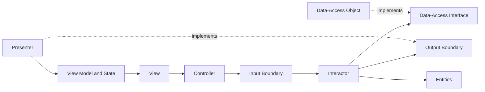

# **PortfolioPilot**

**Authors**: Piper, Hana, Selina, Diyako, and Sam.

**Purpose**: PortfolioPilot is a Java Swing application for tracking investments and exploring financial information. It combines portfolio-management tools, market data, financial analysis, and company-news sentiment in one desktop interface.

The project was developed for **CSC207: Software Design** and is organized using **Clean Architecture**. Each use case separates entities, application rules, interface adapters, data access, and the user interface.

## Table Of Contents

- [Features](#features)
  - [Portfolio Health](#portfolio-health)
  - [Black Litterman](#black-litterman)
  - [Stock Analysis](#stock-analysis)
  - [Watchlist](#watchlist)
  - [News Sentiment](#news-sentiment)
  - [Search](#search)
  - [Risk Preference](#risk-preference)
  - [Currency Conversion](#currency-conversion)
- [External APIs](#external-apis)
- [Requirements](#requirements)
- [Setup](#setup)
- [Testing](#testing)
- [Common Problems](#common-problems)
- [Technologies](#technologies)
- [Repository](#repository)

## Features

- **Account management** — create an account, log in, and store user data locally.
- **Portfolio overview** — view holdings, watchlist items, gains/losses, and daily changes.
- **Holdings management** — add stocks and quantities to a portfolio.
- **Watchlist** — save stocks for later monitoring.
- **Stock search** — search by ticker or company and view stock information, and see similar results to input.
- **News and sentiment** — retrieve company news, group articles as bearish, neutral, or bullish, and calculate an overall sentiment.
- **Portfolio health** — evaluate portfolio performance and diversification.
- **Risk preference** — record the user's investment goals, risk level, and time horizon.
- **Black–Litterman analysis** — generate portfolio-allocation results using market data and investor views.
- **Currency conversion** — convert monetary values using current exchange-rate data.


## Portfolio Health

The Portfolio Health use case evaluates the overall health of an investment portfolio using four quantitative factors: risk-adjusted performance, alignment with the user's risk preference, diversification, and news sentiment.

The portfolio receives an overall score out of **100 points**, with each factor contributing up to 25 points. These thresholds are application-specific scoring rules designed to translate the underlying financial metrics into an interpretable 0–25 scale.:

| Component       | Maximum score |
| --------------- | ------------: |
| Sharpe Ratio    |            25 |
| Risk Alignment  |            25 |
| Diversification |            25 |
| News Sentiment  |            25 |
| **Total**       |       **100** |

### Sharpe Ratio

The Sharpe Ratio component measures the portfolio's risk-adjusted performance. Higher Sharpe ratios receive higher scores:

| Sharpe Ratio | Score |
| -----------: | ----: |
|     `>= 3.0` |    25 |
|     `>= 2.0` |    20 |
|     `>= 1.0` |    15 |
|     `>= 0.0` |    10 |
|      `< 0.0` |     0 |

### Risk Alignment

The Risk Alignment component compares the portfolio's beta against the user's selected risk preference. The target beta is:

| Risk Preference | Target Beta |
| --------------- | ----------: |
| Conservative    |         0.8 |
| Moderate        |         1.0 |
| Aggressive      |         1.2 |

The resulting penalty is converted into a score:

| Difference from target | Score |
| ---------------------: | ----: |
|              `<= 0.00` |    25 |
|              `<= 0.15` |    20 |
|              `<= 0.30` |    15 |
|              `<= 0.45` |    10 |
|              `<= 0.60` |     5 |
|               `> 0.60` |     0 |

### Diversification

PortfolioPilot measures diversification using the **Choueifaty Diversification Ratio (CDR)**. The ratio compares the weighted sum of the individual holdings' volatilities with the overall portfolio volatility:

```
                 Σ(weightᵢ × volatilityᵢ)
CDR = ─────────────────────────────────────────
             portfolio standard deviation
```

A higher CDR indicates greater diversification benefits from combining the portfolio's assets.

The CDR is converted into a score using the following thresholds:


|       CDR | Score |
|----------:| ----: |
| `>= 1.50` |    25 |
| `>= 1.40` |    20 |
| `>= 1.30` |    15 |
|  `>= 1.2` |    10 |
|   `> 1.0` |     5 |
|  `<= 1.0` |     0 |

### News Sentiment

The News Sentiment component incorporates the sentiment of recent news for each stock in the portfolio. News articles are retrieved for each holding and their raw sentiment is calculated using the same sentiment calculation used by the News use case.

Each stock's raw sentiment, ranging from -1.0 to +1.0, is converted into a score from 0 to 25:

```
news points = 12.5 + (12.5 × raw sentiment)
```

This makes 12.5 the neutral score.

The individual stock news scores are weighted according to each holding's share of the total portfolio value. The weighted scores are combined to produce the portfolio's overall News Sentiment score.

If news cannot be retrieved, the application uses the neutral score of 12.5 for that stock.

### Overall Portfolio Health

The four component scores are added together:

```
Portfolio Health =
    Sharpe Score
  + Risk Alignment Score
  + Diversification Score
  + News Sentiment Score
 ```

The resulting score ranges from 0 to 100, providing a single measure that combines portfolio performance, risk, diversification, and current news sentiment.

## Black Litterman

The Black–Litterman use case combines market-based equilibrium expectations with the user's own views about individual stocks. This allows PortfolioPilot to produce expected returns that reflect both the information implied by the market and the user's beliefs.

The analysis first calculates each stock's market-capitalization weight using its closing price and shares outstanding. These weights are used to construct the market equilibrium return vector (Π), together with the covariance matrix of the portfolio's assets. The equilibrium returns use a risk-aversion coefficient of 2.5.

The application displays the user's five most heavily market-cap-weighted stocks. For each stock, the user can enter an expected annual return and select a confidence level, with the corresponding uncertainty:

Low - 0.25   
Medium - 0.50   
High - 0.75   
Very High - 0.90

Because the covariance matrix is estimated from daily returns, the equilibrium returns and user views are converted to daily returns before entering the model. The resulting Black–Litterman returns are then annualized for presentation.
View uncertainty is calculated using:

Ωᵢᵢ = (1 − confidence) × τ × asset variance

where τ = 0.05 represents uncertainty in the prior market estimate. A minimum uncertainty floor is also applied to prevent numerical instability.
The final Black–Litterman expected returns combine the equilibrium market returns with the user's views:

BL return =
[(τΣ)⁻¹ + PᵀΩ⁻¹P]⁻¹[(τΣ)⁻¹Π + PᵀΩ⁻¹Q]

where:

Π is the market-implied equilibrium return vector;  
Σ is the asset covariance matrix;  
P identifies which assets each view applies to;  
Q contains the user's expected returns;  
Ω represents uncertainty in the user's views;  
τ controls uncertainty in the market prior.


The model represents each user view with a pick matrix (P), which identifies the stock associated with that view. The uncertainty of each view is represented by the diagonal Ω (Omega) matrix.
If the user does not provide any active views, the application uses the market equilibrium returns directly. Otherwise, the model blends the market prior and user views according to their specified confidence levels.

The Black–Litterman page displays both the market-estimated return and the adjusted expected return for each selected stock, allowing the user to see how their views affect the model's expectations. 


### Integration with Portfolio Health

The Black–Litterman and Portfolio Health use cases are integrated so that
investor views can directly influence the portfolio's health assessment.

The flow is:

```text
Investor Views
      ↓
Black–Litterman Model
      ↓
Adjusted Expected Returns
      ↓
Portfolio Return / Sharpe Ratio
      ↓
Portfolio Health
      ↓
Score / 100
```

1. Investor Views: The user provides an expected annual return and confidence level for selected stocks.
2. Black–Litterman Model: The model combines the user's views with market-implied equilibrium returns to produce adjusted expected returns.
3. Adjusted Expected Returns: These Black–Litterman outputs are used in the portfolio's performance calculations.
4. Portfolio Return / Sharpe Ratio: The portfolio's expected return and Sharpe Ratio are recalculated using the adjusted expected returns.
5. Portfolio Health: The updated Sharpe Ratio is used to recalculate the portfolio's Health score alongside the other portfolio health factors.
6. Score / 100: The resulting component scores are combined into the final Portfolio Health score out of 100.

## Stock Analysis

The Stock Analysis page provides financial metrics for an individual stock.
After searching for a stock using the search functionality, the application displays:

| Metric | Description |
|---|---|
| Daily Change | The stock's change in price over the most recent trading day |
| Beta | Measures the stock's sensitivity to market movements |
| Alpha | Measures performance relative to the expected market-based return |
| Sharpe Ratio | Measures risk-adjusted return |

These metrics are calculated using the application's financial-analysis
services and historical market data. SPY was consistently used as the benchmark market in the financial analysis.

## Watchlist

The Watchlist use case allows users to save stocks they want to monitor
without adding them to their portfolio.

Users can:
- Search for a stock by ticker.
- Add a stock to their watchlist.
- View their saved watchlist stocks.
- Remove stocks from their watchlist.

Watchlist data is retrieved through the application's data-access
interfaces, keeping the use-case logic independent of the underlying
data source.


## News Sentiment

The News use case accepts a ticker such as `AAPL`, `GOOG`, or `MSFT` and requests related articles from Alpha Vantage.

For each article, the API supplies:

- a ticker-specific sentiment score;
- a relevance score;
- a title, summary, source, and URL.

PortfolioPilot orders the articles by relevance and displays at most **10**. Each article is placed in a bearish, neutral, or bullish column.

The overall conclusion uses relevance-weighted averaging:

```text
weighted sentiment = Σ(sentiment score × relevance score)
                     ──────────────────────────────────────
                              Σ(relevance score)
```

If no useful relevance scores are available, the application falls back to a simple average. The result is classified using these thresholds:

| Weighted score | Result |
|---:|:---|
| `>= 0.15` | Bullish |
| `<= -0.15` | Bearish |
| Between the thresholds | Neutral |

The overall conclusion is calculated from the same articles shown on the page, allowing the user to inspect the evidence behind it.

## Search

To access the search use case, from the home portfolio click on the **Search Stocks** button on the left hand side.

Within the text field under **Query**, you can input a ticker symbol or keyword.
Pressing the **Search** button will begin the search for the given input.
Note that this may take up to 20 seconds depending on how many results will appear.

If there exists an exact match for the given ticker symbol you have searched, the relevant information will show up in the **Ticker Search** results panel.

If there exists stocks with similar company names or tickers for your search query, these will be listed in the **Similar Search** panel, with their relevant information.

If there are no exact matches for your ticker, then an error message will appear under the search bar listed as a **Ticker Search** error.
Similarly, if there are no similar matches to your input, then another error message will appear under the search bar listed as atc **Similar Search** error.

For any given result (either a exact ticker match or a similar stock), there will be a button on the ticker symbol which links to its [stock analysis](#stock-analysis) page.

## Risk Preference

The Risk Preference feature allows users to select and save their investment risk level.

Users can choose from three risk levels:
- **Conservative (Low Risk)**
- **Moderate (Medium Risk)**
- **Aggressive (High Risk)**

To use this feature, select **Risk Preference** from the sidebar, choose a risk level, and save the selection.

The selected risk preference is stored with the user's account so that it can be loaded again after the user logs in.


## Currency Conversion

The Currency Conversion feature allows users to view their total portfolio value in a different currency.

To use this feature, select **Currency** from the sidebar. The user can select a currency and click 
**Convert Portfolio Value** to view the converted portfolio value.

The available currencies include:
- CAD
- USD

Currency exchange rates are retrieved using the Frankfurter API. This feature does not require an Alpha Vantage API key.

## External APIs

| Provider | Use in PortfolioPilot |
|---|---|
| [Alpha Vantage](https://www.alphavantage.co/) | News sentiment, historical prices, company overview information, and ticker search |
| [Frankfurter](https://frankfurter.dev/) | Currency exchange rates |

Alpha Vantage functions used by the project include:

- `NEWS_SENTIMENT`
- `TIME_SERIES_DAILY`
- `OVERVIEW`
- `SYMBOL_SEARCH`

API-specific HTTP and JSON code is kept inside data-access objects. The use-case interactors depend on interfaces rather than directly depending on either API.

## Clean Architecture

The application follows this general flow:



The main responsibilities are:

| Layer | Responsibility | Examples from the News use case |
|---|---|---|
| Entities | Core business data and calculations | `NewsArticle`, `NewsSentiment`, `NewsSentimentCalculator` |
| Use cases | Application rules and boundaries | `NewsInteractor`, `NewsInputBoundary`, `NewsOutputBoundary` |
| Interface adapters | Translate data between the UI and use case | `NewsController`, `NewsPresenter`, `NewsViewModel`, `NewsState` |
| Frameworks and drivers | Swing, files, HTTP, JSON, and external APIs | `NewsView`, `AlphaVantageNewsDataAccessObject` |
| Application setup | Construct and inject dependencies | `NewsUseCaseFactory`, `PortfolioPilotMain` |

This structure supports several course concepts:

- **Single Responsibility Principle:** each class has one main responsibility.
- **Dependency Inversion Principle:** interactors depend on interfaces rather than concrete API classes.
- **Observer pattern:** views react to view-model property changes.
- **Factory and dependency injection:** factory classes construct and connect each use case.

## Project Structure

```text
src/
├── main/java/
│   ├── app/                 # Startup classes and use-case factories
│   ├── data_access/         # Files, HTTP requests, and JSON conversion
│   ├── entity/              # Core business entities and calculations
│   ├── interface_adapter/   # Controllers, presenters, states, and view models
│   ├── use_case/            # Interactors, input/output data, and boundaries
│   └── view/                # Java Swing views
└── test/java/               # JUnit and Mockito tests
```

## Requirements

- **Java 17 or newer**
- **Maven 3.8 or newer**
- An internet connection for market-data and news requests
- A free [Alpha Vantage API key](https://www.alphavantage.co/support/#api-key)
- IntelliJ IDEA is recommended, although another Java IDE can be used

## Setup

### 1. Clone the repository

```bash
git clone https://github.com/PiperScott02/csc207-Project.git
cd csc207-Project
```

### 2. Open the Maven project

In IntelliJ IDEA:

1. Select **File → Open**.
2. Choose the cloned `csc207-Project` folder.
3. Allow IntelliJ to import the Maven dependencies from `pom.xml`.
4. Set the Project SDK to Java 17 or newer.

### 3. Configure Alpha Vantage

Open:

```text
src/main/java/app/PortfolioPilotMain.java
```

Find the placeholder:

```java
final String apiKey = "API_KEY_HERE";
```

Replace `API_KEY_HERE` with your own Alpha Vantage key for local testing.

> **Security:** Never commit a real API key to GitHub. Before committing, restore the placeholder or change the application to read the key from an environment variable.

### 4. Check local user storage

The application expects this file:

```text
data/users.csv
```

Its first line must be exactly:

```csv
username,password,holdings
```

If the header is different, `FileUserDataAccessObject` will stop the application with an explanatory error.

### 5. Run the application

In IntelliJ, open:

```text
src/main/java/app/PortfolioPilotMain.java
```

Run the `main` method in `PortfolioPilotMain`.

The application opens on the signup page. Create an account, log in, and use the sidebar to navigate between features.

## Testing

Run the complete test suite with:

```bash
mvn test
```

Run only the News-related tests with:

```bash
mvn -Dtest='*News*Test' test
```

The test suite includes entity, interactor, controller, presenter, financial-analysis, authentication, watchlist, risk-preference, and currency-conversion tests.

Interactor tests use test doubles for data-access and output-boundary interfaces. This allows application rules to be tested without making real network requests or creating Swing windows.

## Common Problems

### `ALPHA_VANTAGE_API_KEY` or API-key errors

Confirm that `PortfolioPilotMain` receives a valid key and that the key has not exceeded Alpha Vantage's request limit.

### Incorrect `users.csv` header

Make sure the first line of `data/users.csv` is:

```csv
username,password,holdings
```

### Generated files block a Git pull

The `target/` directory contains compiled Maven output. Do not intentionally edit `.class` files. If the repository still tracks generated files, restore them before pulling rather than committing local build output.

### Maven dependencies appear red in IntelliJ

Open the Maven panel and select **Reload All Maven Projects**.

## Technologies

- Java 17
- Java Swing
- Maven
- JUnit 5
- Mockito
- Java `HttpClient`
- OkHttp
- `org.json`
- Gson
- Jackson
- Apache Commons Math

## Repository

[PiperScott02/csc207-Project](https://github.com/PiperScott02/csc207-Project)

See the repository's [contributors page](https://github.com/PiperScott02/csc207-Project/graphs/contributors) for team contributions.
